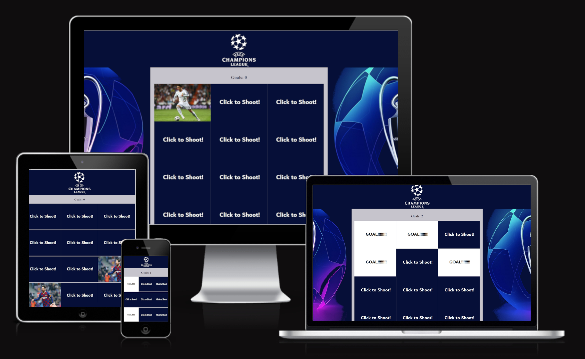

<h1 align="center">Champions League memory Game!</h1>
<h2 align="center">The world's greatest club competition</h2>

This is a memory match game based on Players from the UEFA Champions League. The player challenges their memory by pairing up cards featuring hidden champions from the league by flipping over the cards on the board. The game ends when all champions have been successfully matched.

Play the game [here.](https://8000-paulnolan90-p2footballm-1xm5pzsmyop.ws-eu85.gitpod.io/)

<h4 align="center"></h4>

## Features

- ### Executed:
    - The main section of the screen layout is dedicated to the game play area.
    - background image to suit color of the game and represent champions league trophy.
    - Score(goals) show over game.
    - Game automatically restarts when completed (delay of   3 seconds implemented).

## User Experience (UX) 
- ### User Stories
    - To engage in a memory test game by pairing up identical images.
    - Feedback to confirm each matching pair made and the matched images to change image so I dont play the same card twice.
    - To view my score. 
    - Confirmation that the game is completed.
    - To be able to play on different devices (laptop, mobile and tablet).
    - I anticipate receiving confirmation for each successful match and for the matched images to be displayed.

- ### Design
    - ### Colour scheme:
        - Colours used on the game to match the blue, yellow and red of the official Pokemon colour scheme
    - ### Typography:
        - Google Fonts - [ArchitectsDaughter](https://bit.ly/3EwQP1N)

## User Experience (UX) 

- ### User Stories
    - I want to engage in a memory test game by pairing up identical images.
    - I expect feedback to confirm each matching pair made and the matched images to change image so I dont play the same card twice.
    - I expect to view my score. 
    - I expect confirmation that the game is completed.
    - I expect to be able to play on different devices (laptop, mobile and tablet).
    - I anticipate receiving confirmation for each successful match and for the matched images to be displayed.

## Technologies used

- ### Languages:
    - Javascript
    - CSS 
    - HTML

- ### Frameworks, libraries and programmes:
    - Google Fonts - font used [ArchitectsDaughter](https://bit.ly/3EwQP1N)
    - GIMP image editing software
    - Paint -  to edit image files
    - Git
    - GitHub
## Testing

I used the Chrome Developer Tool to simulate the different viewport sizes for desktop and laptop views, tablet views and mobile views. I used this throughout the development process as well as for testing the website once it was deployed to GitHub Pages.

The deployed website was also tested using Chrome, Edge and Firefox as well as on mobile (using Chrome for Android)

- ### User stories' testing:
    - I would like to play a simple game to test my memory by matching up pairs of images
        - Memory match game uses Pokemon images to test the users memory - hidden images are arranged at random and change position each time the game is loaded
    - I expect feedback to confirm each matching pair made and the matched images remain on show
        - sound effects play at game load stage, with each card turn-over, with each non-successful and successful matching, and successful game completion. Matched image pairs remain on show
    - I expect to see my score
        - score is displayed below the game grid
    - I expect confirmation that I have completed the game successfully
        - on successful game completion, a sound is played and a pop-up modal appears with a congratulaions message
    - I would like the option to restart/replay the game 
        - a button appears below the game grid giving the player the option to restart. This presents a pop-up with a yes/no confirmation option. There is also a replay button within the game completion pop-up modal
    - I expect to be able to play on different devices (laptop, mobile and tablet)
        - the game was tested, and works, on desktop/laptop, tablet and mobile
    - I expect to have fun! :)
        - I had fun! :)

- ### Validator testing:
    - HTML - [W3C Validator](https://bit.ly/31qLrPD) - passed
    - CSS - [(Jigsaw) validator](https://bit.ly/3F29Zg1) - passed
    - Javascript - [JSHint](https://jshint.com/) - passed
- ### Additional testing:
    the website/game was run successfully on the following browsers:

    - Google Chrome
    - Opera
    - Microsoft Edge

    
    All tests passed. Results can be viewed [here](docs/readme_items/website_test_plan.pdf)

- ### Bugs
    - Game grid layout displayed differently at certain mobile screen sizes (iPhone 5/SE in particular). To overcome this issue I adjusted the width percentage for the grid images.
    - Restart game button was being pushed below the bottom line of the game section at larger screen sizes (above 1400px). To correct this I adjusted the bottom margin of the game grid.

## Deployment
### Github Pages
- Site deployed to Github Pages using the following process:
    - Click the 'Settings' tab in the GitHub repository
    - Select 'Pages' in the left hand menu
    - Under the heading of 'Source', select 'Master Branch' from the drop-down menu
    - Click 'Save'

## Credits

### Content:
- Javascript content based on this YouTube video tutorial: [Learn JavaScript by Building 7 Games - Full Course](https://bit.ly/3D45TUl) 
from [freeCodeCamp](https://bit.ly/3bZtVE8) 
 
### Media:
- Champions league logo [Free image webiste](https://freebiesupply.com/logos/uefa-champions-league-logo/)
- Ronaldo Image [Ronadlo website](https://www.liveabout.com/cristiano-ronaldo-3557502)

    